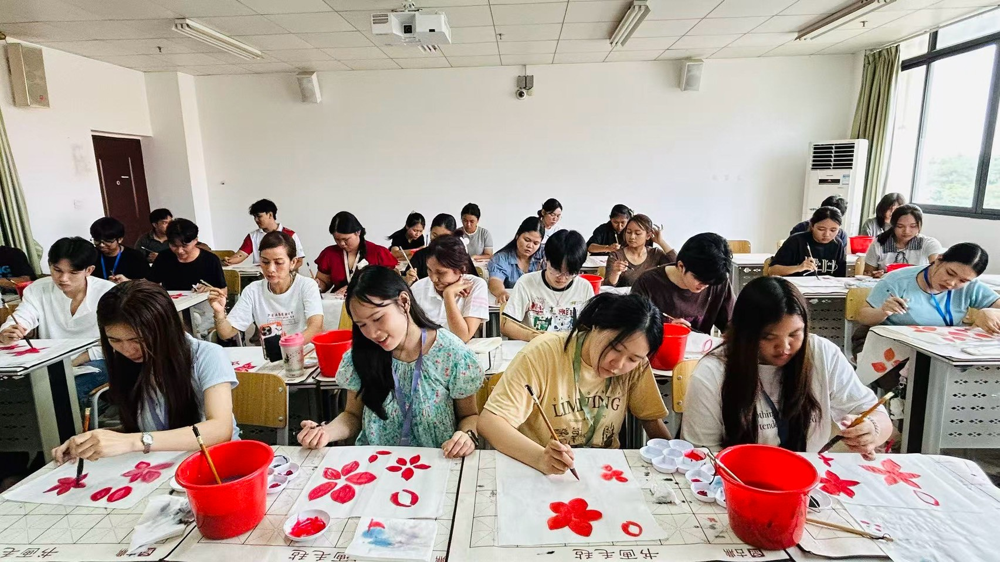
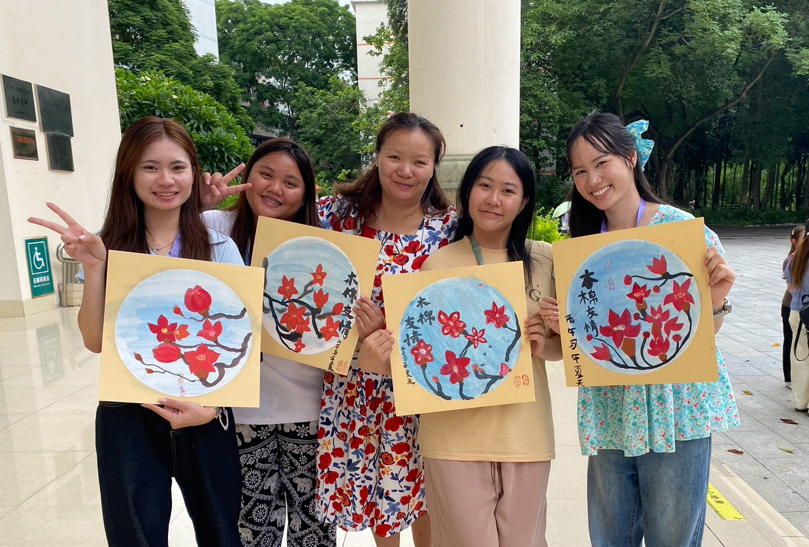
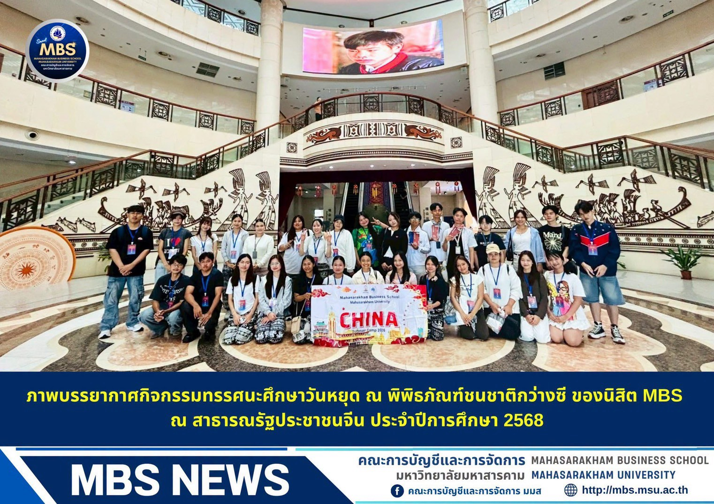
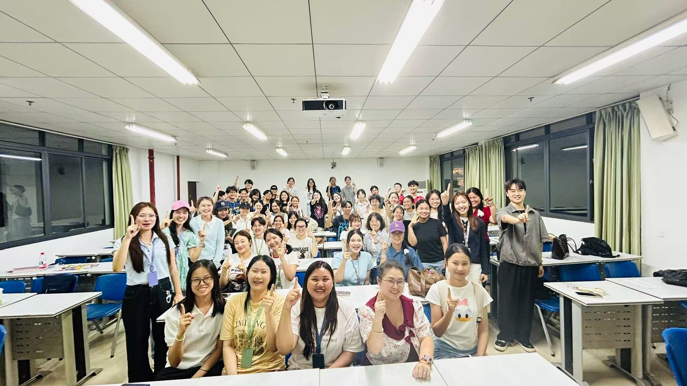

#  China Exchange Program Experience
**Guangxi Minzu University (广西民族大学) | May 31 – June 8, 2026**
---

## 📌 Program Overview

During this academic exchange program at Guangxi Minzu University, I participated in an immersive cross-cultural learning experience designed to enhance global perspective, linguistic competence, and cultural understanding. Key activities and highlights included:

* **Academic & Language Classes:** Engaged in Chinese language coursework to build foundational communication skills and academic knowledge.
* **Traditional Arts & Cultural Workshops:** Hands-on experience with traditional Chinese calligraphy, brush painting, and fan design to gain a deeper understanding of classical Chinese artistic traditions.
* **Cultural Excursions & Field Trips:** Visited key cultural landmarks, including the Guangxi Nationalities Museum, to study local history, regional customs, and interactive heritage exhibits.
* **Cross-Cultural Exchange & Collaboration:** Interacted with local instructors and international peers, fostering cross-cultural team cooperation, communication skills, and lifelong friendships.

---

### 📜 Official Announcement & Certificate of Completion

  
  

  <i>MBS Academic Exchange Program Announcement & Official Certificate of Completion</i>

---

### 🖌️ Chinese Calligraphy & Cultural Workshops

  
  
  
  

  <i>Practicing traditional Chinese calligraphy and brush painting during interactive cultural workshops</i>

---

### 🏛️ Cultural Museum Study & Field Trips

  
   
  
  

  <i>Weekend cultural field trip and group study at the Guangxi Nationalities Museum</i>

---

### 🤝 Friendship & Cross-Cultural Collaboration

  
  

  <i>Building Friendships and Cross-Cultural Communication with International Peers</i>

