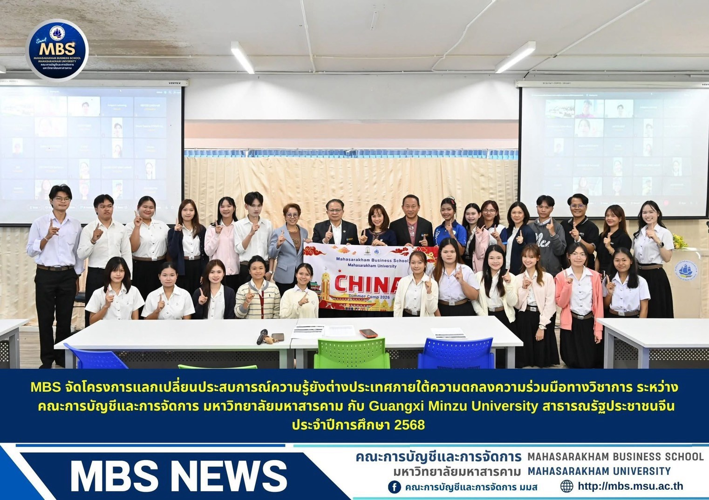
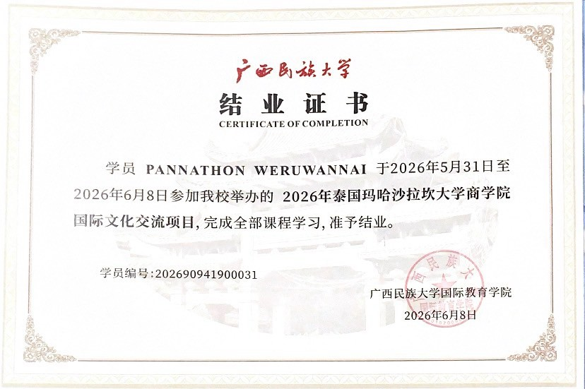
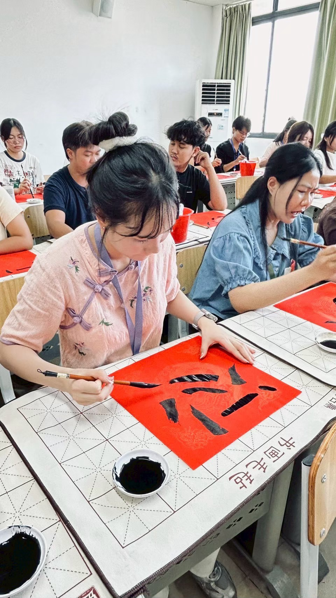
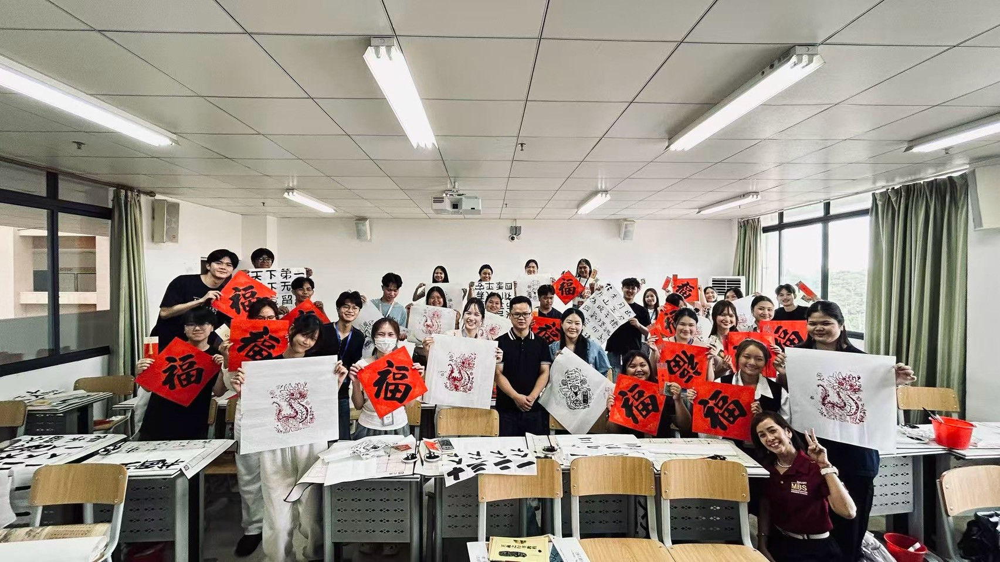
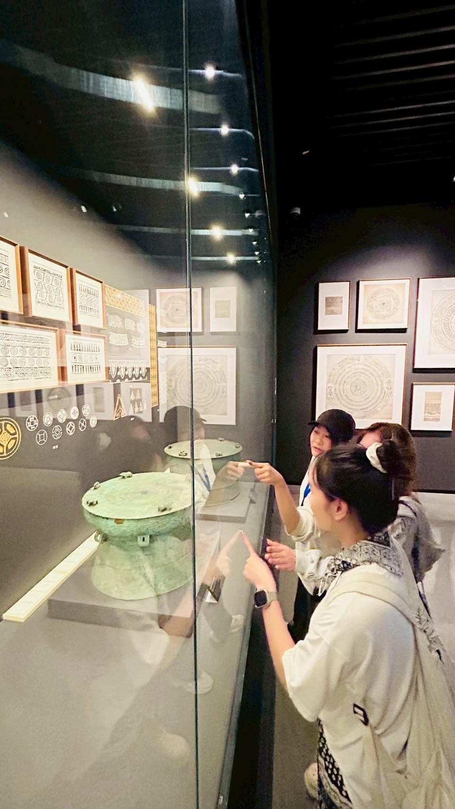
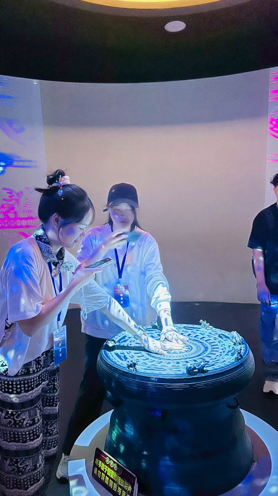
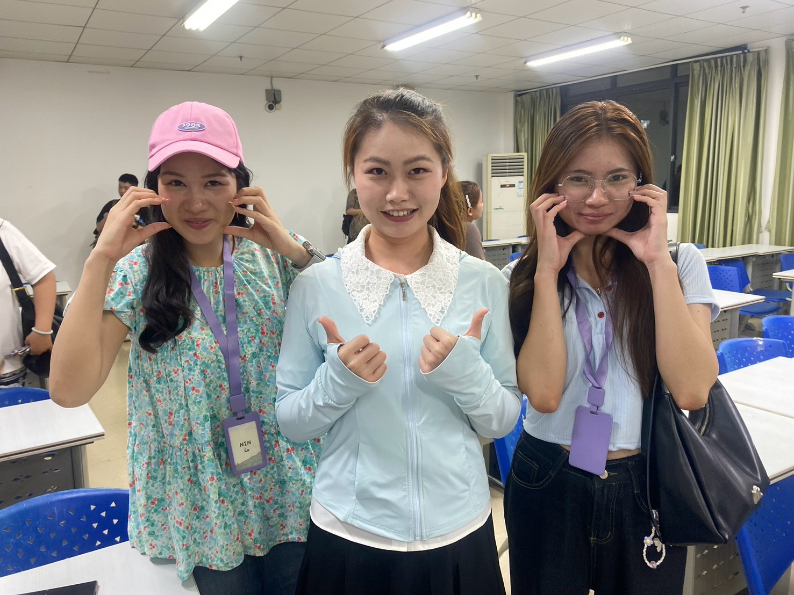

# China Exchange Program Experience
**Guangxi Minzu University (广西民族大学) | May 31 – June 8, 2026**

---

### 📜 Certificate of Completion & Official Announcement

  
  

  <i>MBS Academic Exchange Program Announcement & Official Certificate of Completion</i>

---

### 🖌️ Chinese Calligraphy & Cultural Workshops

  
  

  <i>Hands-on Chinese Calligraphy Session and Group Exhibition with Classmates</i>

---

### 🏛️ Cultural Museum Study & Field Trips

  
  

  <i>Exploring Artifacts and Interactive Digital Displays at Guangxi Museum</i>

---

### 🤝 Friendship & Cross-Cultural Collaboration

  

  <i>Building Friendships and Cross-Cultural Communication with International Peers</i>

